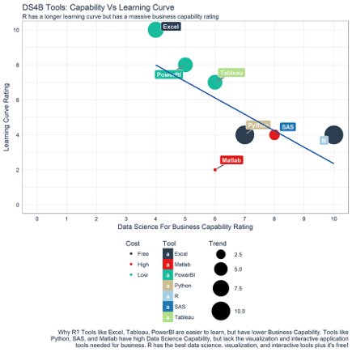
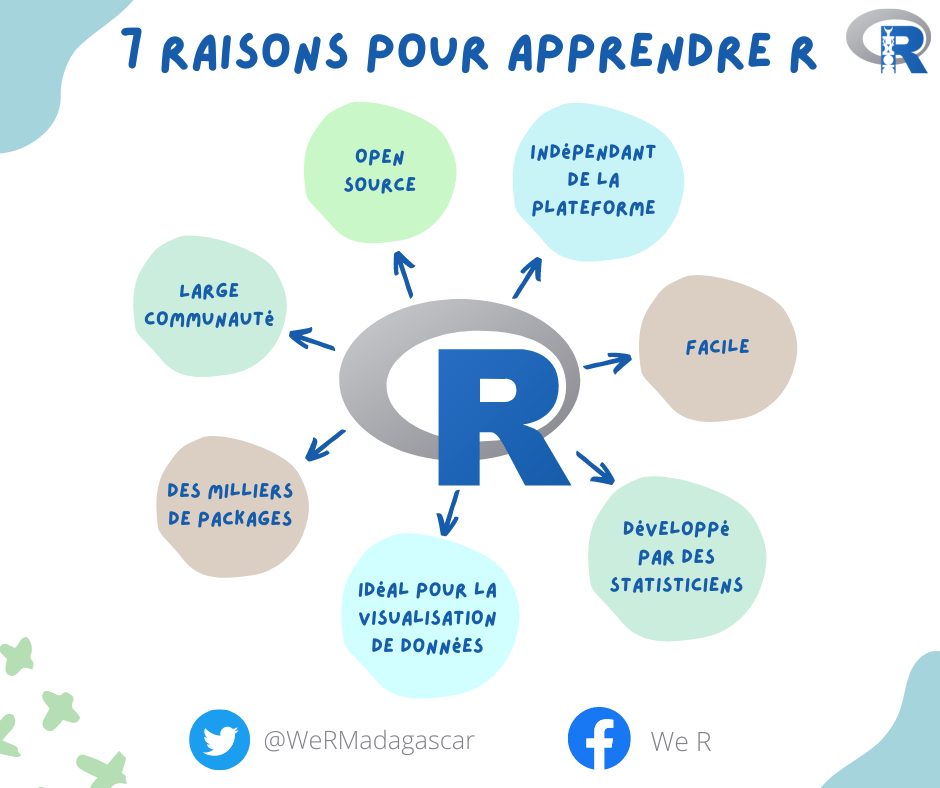
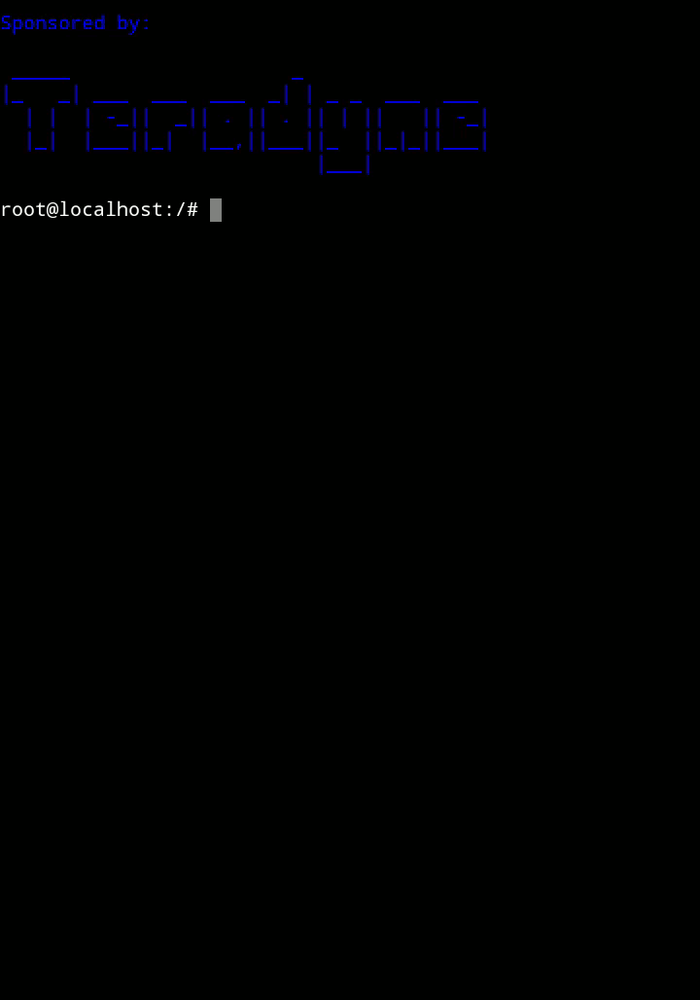
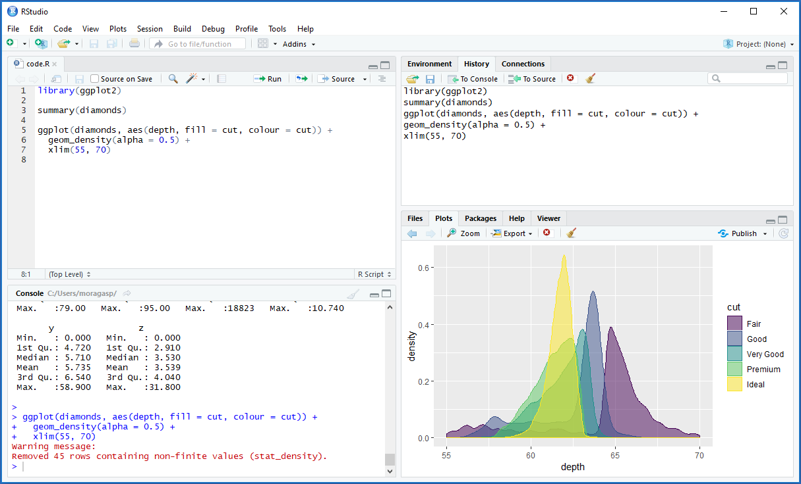
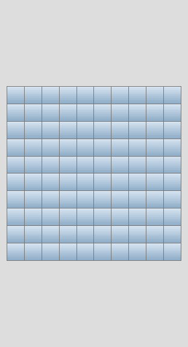
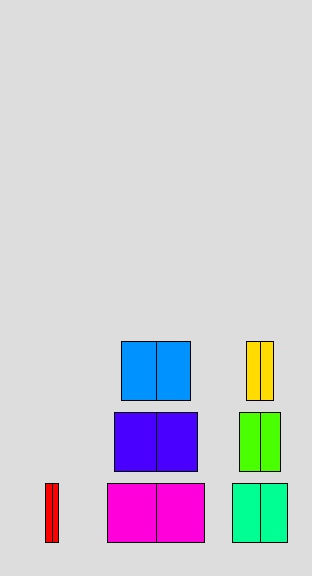

```{r setup, include=FALSE}
knitr::opts_chunk$set(echo = FALSE)
```


```{r message = FALSE, results='hide', include=FALSE, echo=FALSE}
#charger les packages à utiliser
library(dplyr)
library(tidyr)
library(cluster)
library(sqldf)
library(factoextra)
library(fpc)
library(flexclust)
library(purrr)
library(ggplot2)
library(FactoMineR)
library(caret)
library(RANN)
library(kableExtra)
library(ggplotify)
library(plotly)
library(gapminder)
library (highcharter)
library(grid)
```


# Outlines

## <font size="6">Our journey</font> {.flexbox .vcenter .section .reveal .state-background}

<div class="blue">
Topics :<br>
- What is R ? Why we use R ?<br>
- usefull R tools
- R syntax : Basics<br>
- Applications : demos
</div>

# Let's go

## <font size="6">What is R ?</font> {.flexbox .vcenter .section .reveal .state-background}

 R language is an open-source language : **Open-Source**
 
 maintained by a large number of the programmer : **community**
 
 no restriction on its usage: **under the General Public License(GNU)**
 
## <font size="6">R adoption ?</font> {.flexbox .vcenter .section .reveal .state-background}

<div class="row">
<div class="col-sm-6">

</div>
<div class="col-sm-6">

</div>

</div>


## <font size="6">Why use R?</font> {.flexbox .vcenter .section .reveal .state-background}
<div class="row">
<div class="col-sm-10 col-offset-2">

</div>
</div>


# Environnement R & IDE

## <font size="6">R command</font> {.flexbox .vcenter .section .reveal .state-background}

```{r, echo = TRUE }
print("Hello World !")
```



## <font size="6">R IDE</font> {.flexbox .vcenter .section .reveal .state-background}

<div class="row">
<div class="col-sm-4">
<div class="row">

</div>
<div class="row">

</div>
</div>
<div class="col-sm-8">

</div>
</div>


## <font size="6">Fonctions statistiques de base</font>

<div class="col-sm-6">

<div class="row">
```{r cars, echo = TRUE }
summary(cars)
```

</div>

<div class="row" style="height:10em">
<font size="4">Il est aussi plus ergonomique d'utiliser des outils pour le rendu des tableau, comme kable</font>

```{r}
head(pressure)%>%as.data.frame()%>%kable()%>%
  kable_styling(bootstrap_options = c("striped", "hover", "condensed", "responsive"), full_width = F,  position = "left")%>%
  scroll_box(width = "500px", height = "200px")
```
</div>


</div>

<div class="col-sm-6" style="300px">
Fonctions et outils statistiques de base simple et interactif.


```{r fig.width=4, out.width="60%", echo = TRUE}
p <- ggplot(data=pressure, aes(temperature, pressure)) + geom_point()
ggplotly(p ,height=300,width=450)%>%config(displayModeBar = F)
```
</div>


## <font size="6">Interactivity with shiny</font> {.flexbox .vcenter .section .reveal .state-background}
<font size="4">Il est plus intéressant d'intégrer des fonctionalités d'interactivité de shiny pour améliorer l'expérience de l'utilisateur.</font>
<div class="row">
<div class="col-md-4" style="width:300px; padding-left: -80px">
```{r out.width="40%", echo=FALSE}
inputPanel(
  selectInput("n_breaks", label = "Number of bins:",
              choices = c(10, 20, 35, 50), selected = 20),
  
  sliderInput("bw_adjust", label = "Bandwidth adjustment:",
              min = 0.2, max = 2, value = 1, step = 0.2)
)
```
</div>

<div class="col-md-8" style="width:600px; padding-right: -80px">
```{r out.width="70%",echo=FALSE}
renderPlot({
  hist(faithful$eruptions, probability = TRUE, breaks = as.numeric(input$n_breaks),
       xlab = "Duration (minutes)", main = "Geyser eruption duration")
  
  dens <- density(faithful$eruptions, adjust = input$bw_adjust)
  lines(dens, col = "blue")
})
```
</div>
</div>

# Use Cases

## Programmation

- calculs statistiques : parralèle, distribué

- algos : fonctionnel, imperatif

- Data visualisation

- web : shiny, blogdown, markdown,

- redaction scientific : r markdown

## Projects & cool thing

- Visualisation de données

- Jeu

- Résolution sudoku

- 3D

-  Art : https://github.com/djnavarro/flametree

- new #rstats package {raylibr} : https://github.com/jeroenjanssens/raylibr/blob/main/demo/model.R

## Visualisation de données

```{r, echo=FALSE, warning=FALSE}
library(shiny)
library(shinythemes)
library(highcharter)
library(readr)
library(dplyr)
library(tidyr)
library(stringr)
library(forcats)
library(purrr)
library(rmarkdown)
```


```{r, echo=FALSE, warning=FALSE}
options(highcharter.theme = hc_theme_smpl())

langs <- getOption("highcharter.lang")
langs$loading <- "<i class='fas fa-circle-notch fa-spin fa-4x'></i>"
options(highcharter.lang = langs)

url_base <- "http://graphics8.nytimes.com/newsgraphics/2016/01/01/weather"

cities <- file.path(url_base, "656641daa55247f6c606970a6b7e702e3fd4dcb8/cities_loc_new.csv") %>% 
  read_csv(
    col_types = cols(
      station = col_character(),
      state_fullname = col_character(),
      name = col_character(),
      state = col_character(),
      latitude = col_double(),
      longitude = col_double(),
      id = col_character()
    )
  ) %>% 
  sample_frac(1) %>% 
  mutate(text = paste0(name, ", ", state))

citiesv <- setNames(cities$id, cities$text)
```

<div class="row">


<div class="col-md-6" style="width:50%,height:50%">
```{r out.width="110%", echo=FALSE, warning=FALSE}

inputPanel(
  selectInput("city", NULL, choices = citiesv, selectize = TRUE, width = "100%")
)

```
</div>
</div>

```{r out.width="50%", echo= FALSE, warning=FALSE}
data <- reactive({
    
    # highchartProxy("hc1") %>%
    #   hcpxy_loading(action = "show")
    # 
    # highchartProxy("hc2") %>%
    #   hcpxy_loading(action = "show")
    
    url_file <- file.path(url_base, "assets", sprintf("%s.csv", input$city))
    
    # url_file <- "http://graphics8.nytimes.com/newsgraphics/2016/01/01/weather/assets/new-york_ny.csv"
    message(url_file)
    
    data <- read_csv(
      url_file,
      col_types = cols(
        date = col_date(format = ""),
        month = col_double(),
        temp_max = col_double(),
        temp_min = col_double(),
        temp_rec_max = col_logical(),
        temp_rec_min = col_logical(),
        temp_avg_max = col_double(),
        temp_avg_min = col_double(),
        temp_rec_high = col_logical(),
        temp_rec_low = col_logical(),
        precip_value = col_double(),
        precip_actual = col_double(),
        precip_normal = col_double(),
        precip_rec = col_character(),
        snow_rec = col_character(),
        annual_average_temperature = col_double(),
        departure_from_normal = col_double(),
        total_precipitation = col_double(),
        precipitation_departure_from_normal = col_double()
        )
      ) %>% 
      mutate(dt = datetime_to_timestamp(date)) 
    
    data
    
  })
  
  temps <- reactive({
    
    data <- data()
    
    dtempgather <- data %>% 
      select(dt, date, starts_with("temp")) %>% 
      select(-temp_rec_high, -temp_rec_low) %>% 
      rename(temp_actual_max = temp_max,
             temp_actual_min = temp_min) %>% 
      gather(key, value, -date, -dt) %>% 
      mutate(key = str_replace(key, "temp_", ""),
             value = as.numeric(value)) 
    
    dtempspread <- dtempgather %>% 
      separate(key, c("serie", "type"), sep = "_") %>% 
      spread(type, value) %>% 
      filter(!is.na(max) | !is.na(min))
    
    temps <- dtempspread %>% 
      mutate(serie = factor(serie, levels = c("rec", "avg", "actual")),
             serie = fct_recode(serie, Record = "rec", Normal = "avg", Observed = "actual"))
    
    temps
    
  })
  
  records <- reactive({
    
    data <- data()
    
    records <- data %>%
      select(dt, date, temp_rec_high, temp_rec_low) %>% 
      filter(temp_rec_high != "NULL" | temp_rec_low != "NULL") %>% 
      mutate_if(is.character, str_extract, "\\d+") %>% 
      mutate_if(is.character, as.numeric) %>% 
      gather(type, value, -date, -dt) %>% 
      filter(!is.na(value)) %>% 
      mutate(type = str_replace(type, "temp_rec_", ""),
             type = paste("This year record", type))
    
    records
    
  })
  
  precip_day <- reactive({
    
    data <- data()
    
    precip_day <- data %>% 
      mutate(temp_day = temp_min + (temp_max - temp_min)/2) %>% 
      select(date, dt, temp_day, month, precip_value) %>% 
      group_by(month) %>% 
      mutate(precip_day = c(0, diff(precip_value))) %>% 
      ungroup() %>% 
      filter(precip_day > 0 | row_number() == 1 | row_number() == n()) 
    
    precip_day 
    
  })
  
  precip <- reactive({
    
    data <- data()
    
    precip <- select(data, dt, date, precip_value, month)
    
    precip
    
  })
  
  precipnormal <- reactive({
    
    data <- data()
    
    precipnormal <- data %>%
      select(date, dt, precip_normal, month) %>%
      group_by(month) %>%
      filter(row_number() %in% c(1, n())) %>%
      ungroup() %>%
      fill(precip_normal)
    
    precipnormal
    
  })
```
  
  
<div class="col-md-3">
```{r}
  renderHighchart({
    
    temps <- temps()
    precip_day <- precip_day()
    
    temps1 <- filter(temps, serie == "Observed")
    temps2 <- filter(temps, serie != "Observed")
    
    colors <- c("#ECEBE3", "#C8B8B9")
    colors <- colors[which(levels(temps2$serie) %in% unique(temps2$serie))]
    colors <- hex_to_rgba(colors, 0.9)
    
    hchart(temps2, "columnrange",  hcaes(date, low = min, high = max, group = serie),
           color = colors) %>% 
      hc_add_series(temps1, "columnrange",  hcaes(date, low = min, high = max, color = max),
                    name = "Observed", color = "#FCAF13") %>% 
      hc_add_series(precip_day, "line", hcaes(dt, y = temp_day, size = precip_day),
                    name = "precipitation", 
                    zIndex = 4, color = hex_to_rgba("#008ED0", 0.2), lineWidth = 0,
                    marker = list(radius = 8)) %>% 
      hc_chart(polar = TRUE) %>% 
      hc_plotOptions(series = list(borderWidth = 0, pointWidth = 0.01)) %>%
      hc_yAxis(endOnTick = FALSE, showFirstLabel = FALSE, showLastLabel = FALSE) %>% 
      hc_xAxis(type = "datetime", showLastLabel = FALSE,
               dateTimeLabelFormats = list(month = "%B")) %>% 
      hc_tooltip(shared = TRUE, useHTML = TRUE,
                 headerFormat = as.character(tags$small("{point.x: %b %d}", tags$br()))) 
      
  })

```
</div> 

<div class="col-md-9">
  
```{r}
  
   renderHighchart({
    
    temps <- temps()
    records <- records()
    precip <- precip()
    precipnormal <- precipnormal()
    precip_day <- precip_day()
    
    hc <- highchart() %>%
      hc_xAxis(type = "datetime", showLastLabel = FALSE,
               dateTimeLabelFormats = list(month = "%B")) %>% 
      hc_tooltip(shared = TRUE, useHTML = TRUE,
                 headerFormat = as.character(tags$small("{point.x: %b %d}", tags$br()))) %>% 
      hc_plotOptions(series = list(borderWidth = 0, pointWidth = 4))
    
    colors <- c("#ECEBE3", "#C8B8B9", "#A90048")
    colors <- colors[which(levels(temps$serie) %in% unique(temps$serie))]
    
    hc <- hc %>% 
      hc_add_series(temps, type = "columnrange",
                    hcaes(dt, low = min, high = max, group = serie),
                    color = colors) 
    
    if(nrow(records) > 0) {
      
      pointsyles <- list(
        symbol = "circle",
        lineWidth= 1,
        radius= 4,
        fillColor= "#FFFFFF",
        lineColor= NULL
      )
      
      hc <- hc %>% 
        hc_add_series(records, "point", hcaes(x = dt, y = value, group = type),
                      marker = pointsyles)
    }
    
    axis <- create_yaxis(
      naxis = 2,
      heights = c(3,1),
      sep = 0.05,
      turnopposite = FALSE,
      showLastLabel = FALSE,
      startOnTick = FALSE)
    
    axis[[1]]$title <- list(text = "Temperature")
    axis[[1]]$labels <- list(format = "{value}°F")
    
    axis[[2]]$title <- list(text = "Precipitation")
    axis[[2]]$min <- 0
    
    hc <- hc_yAxis_multiples(hc, axis)
    
    hc <- hc %>%
      hc_add_series(precip, type = "area", hcaes(dt, precip_value, group = month),
                    name = "Precipitation", color = "#008ED0", lineWidth = 1,
                    yAxis = 1, fillColor = "#EBEAE2", 
                    id = c("p", rep(NA, 11)), linkedTo = c(NA, rep("p", 11))) %>% 
      hc_add_series(precipnormal, "line", hcaes(x = dt, y = precip_normal, group = month),
                    name = "Normal Precipitation", color = "#008ED0", yAxis = 1,
                    id = c("np", rep(NA, 11)), linkedTo = c(NA, rep("np", 11)),
                    lineWidth = 1)
    
    hc
    
  })
```

</div>

## Codes

```{r, echo = T, eval=F}
  renderHighchart({
    
    temps <- temps()
    precip_day <- precip_day()
    
    temps1 <- filter(temps, serie == "Observed")
    temps2 <- filter(temps, serie != "Observed")
    
    colors <- c("#ECEBE3", "#C8B8B9")
    colors <- colors[which(levels(temps2$serie) %in% unique(temps2$serie))]
    colors <- hex_to_rgba(colors, 0.9)
    
    hchart(temps2, "columnrange",  hcaes(date, low = min, high = max, group = serie),
           color = colors) %>% 
      hc_add_series(temps1, "columnrange",  hcaes(date, low = min, high = max, color = max),
                    name = "Observed", color = "#FCAF13") %>% 
      hc_add_series(precip_day, "line", hcaes(dt, y = temp_day, size = precip_day),
                    name = "precipitation", 
                    zIndex = 4, color = hex_to_rgba("#008ED0", 0.2), lineWidth = 0,
                    marker = list(radius = 8)) %>% 
      hc_chart(polar = TRUE) %>% 
      hc_plotOptions(series = list(borderWidth = 0, pointWidth = 0.01)) %>%
      hc_yAxis(endOnTick = FALSE, showFirstLabel = FALSE, showLastLabel = FALSE) %>% 
      hc_xAxis(type = "datetime", showLastLabel = FALSE,
               dateTimeLabelFormats = list(month = "%B")) %>% 
      hc_tooltip(shared = TRUE, useHTML = TRUE,
                 headerFormat = as.character(tags$small("{point.x: %b %d}", tags$br()))) 
      
  })

```


## Games

```{r , eval=FALSE, echo=T}
library(fun)

if (.Platform$OS.type == "windows")
         x11() else x11(type = "Xlib")

mine_sweeper()
```




## Mine sweeper source code

```{r, eval=FALSE, echo=T}
#' Play the Mine Sweeper game in R
#'
#' The controls should be familiar to you: Click the left mouse button to dig in
#' an area, and right button to mark or unmark the area with flags.
#' @param width number of grids in horizontal axis
#' @param height number of grids in vertical axis
#' @param mines number of mines
#' @param cheat logical. If \code{TRUE} a matrix indicating the mines will be
#'   printed
#' @author Yixuan Qiu \email{yixuan.qiu@@cos.name}
#' @note Linux/Mac users have to use \code{X11(type = 'Xlib')} or the Cairo
#'   graphics device \code{Cairo()} in the package \pkg{cairoDevice}.
#' @references \url{https://en.wikipedia.org/wiki/Minesweeper_(computer_game)}
#' @export
#' @examples
#' ## should use Xlib for the x11() device under *nix, e.g
#' if (interactive()) {
#'   if (.Platform$OS.type == 'windows') x11() else x11(type = 'Xlib')
#'   mine_sweeper()
#' }
mine_sweeper <- function(width = 10, height = 10, mines = 20, cheat = FALSE) {
  # Deal with some exceptions
  if (!interactive()) return()
  if (mines >= width * height) {
    stop("Are you a terrorist??? Too many mines!")
  }
  if (width <= 0 | height <= 0 | mines <= 0) {
    stop("width, height and mines should be positive!")
  }
  width <- floor(width)
  height <- floor(height)
  mines <- floor(mines)

  m <- rep(0, width * height)
  # Status: 0 for untested areas, 1 for tested areas, 2 for flags
  mat.status <- matrix(m, height, width)
  mine.index <- sample(width * height, mines)
  m[mine.index] <- -10
  mine.mat <- matrix(m, height, width)
  search.mine <- which(mine.mat < 0, arr.ind = TRUE)
  mine.row <- search.mine[, 1]
  mine.col <- search.mine[, 2]
  # Calculate the number of mines in every 3x3 square
  for (i in 1:mines) {
    mrow <- intersect(1:height, (mine.row[i] - 1):(mine.row[i] + 1))
    mcol <- intersect(1:width, (mine.col[i] - 1):(mine.col[i] + 1))
    mine.mat[mrow, mcol] <- mine.mat[mrow, mcol] + 1
  }
  mine.mat <- ifelse(mine.mat < 0, -1, mine.mat)
  # -1 for mines
  if (cheat) print(mine.mat)

  # Plot a grid
  plot.grid <- function(x, y, w = 1, h = 1, col1 = "#D6E3F0", col2 = "#92B0CA", slices = 10) {
    # Generate contiguous colors
    f <- colorRampPalette(c(col1, col2))
    cols <- f(slices)
    xs <- rep(x, slices)
    ys <- seq(y + 0.5 * h - 0.5 * h / slices, y - 0.5 * h + 0.5 * h / slices,
              length.out = slices)
    gwidth <- rep(w, slices)
    gheight <- rep(h / slices, slices)
    # Rectangles with contiguous colors
    symbols(xs, ys, rectangles = cbind(gwidth, gheight), fg = cols, bg = cols,
            inches = FALSE, add = TRUE)
    #         polygon(x + c(-0.5, -0.5, -0.45) * w,
    #                 y + c(0.45, 0.5, 0.5) * h,
    #                 border = NA, col = "#DDDDDD")
    #         polygon(x + c(0.45, 0.5, 0.5) * w,
    #                 y + c(0.5, 0.5, 0.45) * h,
    #                 border = NA, col = "#DDDDDD")
    #         polygon(x + c(-0.5, -0.5, -0.45) * w,
    #                 y + c(-0.5, -0.45, -0.5) * h,
    #                 border = NA, col = "#DDDDDD")
    #         polygon(x + c(0.45, 0.5, 0.5) * w,
    #                 y + c(-0.5, -0.45, -0.5) * h,
    #                 border = NA, col = "#DDDDDD")
    #         polygon(x + c(-0.5, -0.45, 0.45, 0.5, 0.5, 0.45, -0.45, -0.5) * w,
    #                 y + c(0.45, 0.5, 0.5, 0.45, -0.45, -0.5, -0.5, -0.45) * h,
    #                 border = "#777777", lwd = 1)
    # Border
    polygon(x + c(-0.5, -0.5, 0.5, 0.5) * w, y + c(-0.5, 0.5, 0.5, -0.5) * h,
            border = "#777777")
  }

  # Plot the interface
  par(mar = c(0, 0, 0, 0), bg = "#DDDDDD")
  plot(1, type = "n", asp = 1, xlab = "", ylab = "",
       xlim = c(0.5, width + 0.5), ylim = c(0.5, height + 0.5), axes = FALSE)
  # Set font for X11 device
  if(.Device == "X11") {
    fixed <- X11Font("-*-fixed-*-*-*-*-*-*-*-*-*-*-*-*")
    X11Fonts(fixed = fixed)
    par(family = "fixed")
  }
  x.grid <- (width + 1) / 2
  y.grid <- 1:height
  for (i in 1:height)  plot.grid(x.grid, y.grid[i], w = width, h = 1)
  x0 <- x1 <- seq(1.5, by = 1, length.out = width - 1)
  y0 <- rep(0.5, width - 1)
  y1 <- y0 + height
  segments(x0, y0, x1, y1, col = "#777777")

  # Colors to draw numbers
  col.palette <- c("DarkBlue", "ForestGreen", "brown", "green",
                   "blue", "yellow", "orange", "red")
  # Function to determine the font size of numbers
  text.cex <- function() {
    ps <- par("ps")
    0.6 * min(dev.size(units = "px") / c(width, height)) / ps
  }
  # Plot numbers -- vectorized
  plot.num <- function(x, y, num) {
    for(i in 1:length(x))  plot.grid(x[i], y[i], col1 = "#FFFFFF", col2 = "#C8C8C8")
    pnum = num[num > 0]
    px = x[num > 0]
    py = y[num > 0]
    text(px, py, pnum, col = col.palette[pnum], cex = text.cex())
  }
  # Draw unexploded mines -- vectorized
  plot.mine <- function(x, y) {
    for(i in 1:length(x))  plot.grid(x[i], y[i], col1 = "#FFFFFF", col2 = "#C8C8C8")
    symbols(x, y, circles = rep(0.35, length(x)),
            inches = FALSE, fg = NULL, bg = "black", add = TRUE)
    op = par(lend = 2)
    segments(x - 0.4, y, x + 0.4, y, col = "black", lwd = 5)
    segments(x, y - 0.4, x, y + 0.4, col = "black", lwd = 5)
    d = 0.4 / sqrt(2)
    segments(x - d, y - d, x + d, y + d, col = "black", lwd = 5)
    segments(x - d, y + d, x + d, y - d, col = "black", lwd = 5)
  }
  # Draw the exploded mine
  plot.mine.explode <- function(x, y) {
    plot.grid(x, y, col1 = "#FFFFFF", col2 = "#C8C8C8")
    star <- t(matrix(c(0.3, 0.4), 20, length(x)))
    symbols(x, y, stars = star, inches = FALSE, bg = "red", fg = NA, add = TRUE)
    symbols(x, y, stars = 0.7 * star, inches = FALSE, bg = "yellow", fg = NA, add = TRUE)
  }
  # Draw flags -- vectorized
  plot.flag <- function(x, y) {
    symbols(x + 0.075, y + 0.2,
            rectangles = matrix(rep(c(0.35, 0.2), rep(length(x), 2)), ncol = 2),
            inches = FALSE, fg = "red", bg = "red", add = TRUE)
    symbols(x, y - 0.25,
            rectangles = matrix(rep(c(0.6, 0.1), rep(length(x), 2)), ncol = 2),
            inches = FALSE, fg = "black", bg = "black", add = TRUE)
    segments(x - 0.1, y + 0.3, x - 0.1, y - 0.2)
  }
  search.zeroes <- function(pos, mat) {
    nr <- nrow(mat)
    nc <- ncol(mat)
    x <- ifelse(pos %% nr == 0, nr, pos %% nr)
    y <- ceiling(pos / nr)
    areas <- c(pos, (x > 1 & y > 1) * (pos - nr - 1), (y > 1) * (pos - nr),
               (x < nr & y > 1) * (pos - nr + 1), (x > 1) * (pos - 1),
               (x < nr) * (pos + 1), (x > 1 & y < nc) * (pos + nr - 1),
               (y < nc) * (pos + nr), (x < nr & y < nc) * (pos + nr + 1))
    areas <- unique(areas[areas != 0])
    zeroes <- intersect(areas, which(mat == 0))
    return(list(zeroes = zeroes, areas = areas))
  }

  mousedown <- function(buttons, x, y) {
    ## At least under Ubuntu, right click leads to buttons = c(0, 1)
    if (length(buttons) == 2) buttons <- 2
    plx <- round(grconvertX(x, "ndc", "user"))
    ply <- round(grconvertY(y, "ndc", "user"))
    ms <- mat.status
    if (plx < 1 || plx > width || ply < 1 || ply > height || buttons == 1) {
      return(ms)
    }
    current.status <- ms[height + 1 - ply, plx]
    current.mat <- mine.mat[height + 1 - ply, plx]
    ## Left button
    if (buttons == 0) {
      ## Untested area
      if (current.status == 0) {
        ## Is a mine
        if (current.mat == -1) {
          plot.mine(mine.col, height + 1 - mine.row)
          plot.mine.explode(plx, ply)
          cat("Game Over!\n")
          return(-1)
          ## Blank area
        } else if (current.mat == 0) {
          pos <- height * plx + 1 - ply
          while (TRUE) {
            temp <- pos
            lst <- search.zeroes(pos, mine.mat)
            pos <- lst$zeroes
            if (length(pos) == length(temp)) {
              areas <- lst$areas
              areas.row <- ifelse(areas %% height == 0, height, areas %% height)
              areas.col <- ceiling(areas / height)
              plot.num(areas.col, height + 1 - areas.row, mine.mat[areas])
              ms[areas] <- 1
              break
            }
          }
          if (sum(ms == 1) == width * height - mines) {
            plot.flag(mine.col, height + 1 - mine.row)
            cat("You win!\n")
            return(1)
          }
          return(ms)
          ## Numbered area
        } else {
          plot.num(plx, ply, current.mat)
          if (sum(ms == 1) == width * height - mines -1) {
            plot.flag(mine.col, height + 1 - mine.row)
            cat("You win!\n")
            return(1)
          }
          ms[height + 1 - ply, plx] <- 1
          return(ms)
        }
        ## Tested area or flag -- no action
      } else {
        return(ms)
      }
    }
    ## Right button
    if (buttons == 2) {
      ## Blank area
      if (current.status == 0) {
        ms[height + 1 - ply, plx] <- 2
        plot.flag(plx, ply)
        return(ms)
        ## Flag
      } else if (current.status == 2) {
        ms[height + 1 - ply, plx] <- 0
        plot.grid(plx, ply)
        return(ms)
        ## Numbered area -- no action
      } else {
        return(ms)
      }
    }
    return(ms)
  }

  while (TRUE) {
    if (length(mat.status) == 1) break
    mat.status <- getGraphicsEvent(prompt = "", onMouseDown = mousedown)
  }
}
```

## Hanoi Tower


```{r , eval=FALSE, echo=T}
library(fun)

if (.Platform$OS.type == "windows")
         x11() else x11(type = "Xlib")

tower_of_hanoi()
```


## Hanoi Tower source code

```{r, eval=FALSE,echo=TRUE}
#' Demonstrate the Tower of Hanoi puzzle in R
#'
#' This function uses the recursive algorithm to solve the Tower of Hanoi
#' puzzle, and demonstrates the game in animation.
#'
#' This function was written by Linlin Yan <linlin.yan@@cos.name> in a Chinese
#' forum (See 'References') to show the usage of recursive algorithm.
#' @param n an integer indicating the number of disks on the rot.
#' @seealso \code{\link[graphics]{barplot}}
#' @references Original code: \url{https://d.cosx.org/d/101199}
#'
#'   About the Tower of Hanoi: \url{https://en.wikipedia.org/wiki/Tower_of_Hanoi}
#' @author Linlin Yan <\email{linlin.yan@@cos.name}>
#' @export
#' @examples
#' \dontrun{
#' tower_of_hanoi(7)
#' }
tower_of_hanoi <- function(n = 7) {
  if (!interactive()) return()
  tower <- list(1:n, NULL, NULL)
  color <- rainbow(n)
  par(mfrow = c(1, 3), mar = rep(0, 4), ann = FALSE)
  bgcolor <- par("bg")
  if (bgcolor == "transparent") bgcolor <- "white"

  draw.hanoi <- function() {
    for (i in 1:3) {
      plot(c(-n, n), c(0, n + 2), type = "n", xlab = "",
           ylab = "", axes = FALSE)
      rect(-n, 0, n, n + 2, border = bgcolor, col = bgcolor)
      if (length(tower[[i]]) > 0) {
        barplot(rev(tower[[i]]), add = TRUE, horiz = TRUE,
                col = color[rev(tower[[i]])])
        barplot(-rev(tower[[i]]), add = TRUE, horiz = TRUE,
                col = color[rev(tower[[i]])])
      }
    }
  }

  move.hanoi <- function(k, from, to, via) {
    if (k > 1) {
      move.hanoi(k - 1, from, via, to)
      move.hanoi(1, from, to, via)
      move.hanoi(k - 1, via, to, from)
    }
    else {
      cat("Move ", tower[[from]][1], " from ", LETTERS[from],
          " to ", LETTERS[to], "\n")
      tower[[to]] <<- c(tower[[from]][1], tower[[to]])
      tower[[from]] <<- tower[[from]][-1]
      draw.hanoi()
      Sys.sleep(0.5)
    }
  }

  draw.hanoi()
  move.hanoi(n, 1, 2, 3)
}
```

## Sudoku

```{r , eval=FALSE, echo=T}
library(sudoku)

todays_puzzle<-fetchSudokuUK()

if (.Platform$OS.type == "windows")
         x11() else x11(type = "Xlib")

playSudoku(todays_puzzle)

```

## How to solve Sudoku

### OMPR (Optimization Modeling Package)

> solve Mixed Integer Linear Programs

```{r, eval=FALSE, echo=T}
install.packages("ompr")
install.packages("ompr.roi")

# remotes::install_github("dirkschumacher/ompr")
# remotes::install_github("dirkschumacher/ompr.roi")
```

>  Sudoku as a Constraint Satisfaction Problem


Un CSP est définie par le triple $$\langle X,D,C \rangle$$ , tel que
variables,

$$X=\{X_{1},\ldots ,X_{n}\}$$ 

domains of values,

$$D=\{D_{1},\ldots ,D_{n}\}$$
set of constraints.

$$C=\{C_{1},\ldots ,C_{m}\}$$ 

## Code examples MIPModel

### Creation du modèle

```{r, echo=T}
library(ompr)
library(dplyr)
n <- 9 # 9 chiffres
model <- MIPModel() %>%
  
  # nombre k sur la position i,j
  add_variable(x[i, j, k], i = 1:n, j = 1:n, k = 1:9, type = "binary") %>%
  
  # pas d'objectif
  set_objective(0) %>%
  
  # n'accepter que des nombres par cellule
  add_constraint(sum_over(x[i, j, k], k = 1:9) == 1, i = 1:n, j = 1:n) %>%
  
  # nombre unique sur la ligne
  add_constraint(sum_over(x[i, j, k], j = 1:n) == 1, i = 1:n, k = 1:9) %>%
  
  # nombre unique sur le colone
  add_constraint(sum_over(x[i, j, k], i = 1:n) == 1, j = 1:n, k = 1:9) %>% 
  
  # chaque 3x3 contient tous les nombres
  add_constraint(sum_over(x[i, j, k], i = 1:3 + sx, j = 1:3 + sy) == 1, 
                 sx = seq(0, n - 3, 3), sy = seq(0, n - 3, 3), k = 1:9)
model
```

## glpk
### Résolution

```{r, echo=T}
library(ompr.roi)
library(ROI.plugin.glpk)
result <- solve_model(model, with_ROI(solver = "glpk", verbose = TRUE))
```

## Matrice
### Solution

```{r, echo=T}
result %>% 
  get_solution(x[i,j,k]) %>%
  filter(value > 0) %>%  
  select(i, j, k) %>% 
  tidyr::spread(j, k) %>% 
  select(-i)
```


